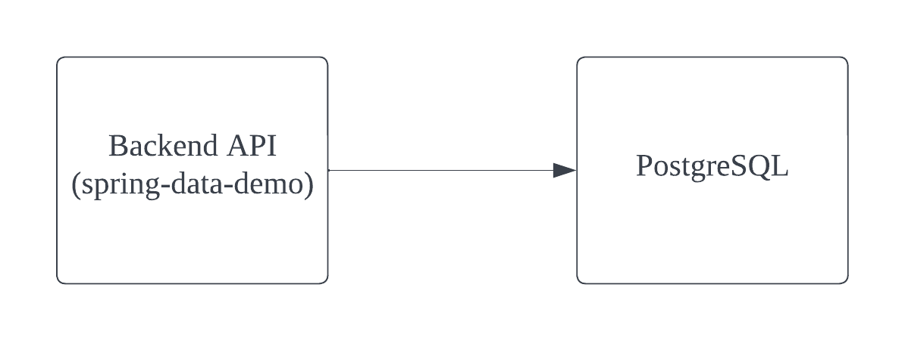

# spring-data-demo

A simple Spring demo project with Spring Data, it exposes the REST API to manage the employees. Data is stored in the
relational database. In this repo, we use PostgreSQL for demonstration purpose, you could easily change to the database
you want.

### High-level architecture



### API specification

Postman collection: https://documenter.getpostman.com/view/1885209/2s8YeprCCq

### How to run the application

1. Install [JDK 11](https://www.oracle.com/java/technologies/javase-jdk11-downloads.html).
1. Install [Maven](https://maven.apache.org/download.cgi?Preferred=ftp://mirror.reverse.net/pub/apache/).
1. Install [Docker for Desktop](https://www.docker.com/products/docker-desktop).
1. Clone this project to your local machine.
1. Open terminal and make sure you're at the root directory of this project, run the command ```docker-compose up``` (this will automatically setup PostgreSQL for you).
1. Import project to your favorite IDE or run it directly with ```mvn spring-boot:run```

That's all.
